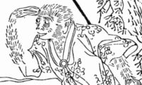

  

<h1 align="center">Wukong JS</h1>
<h3 align="center">Didactic javascript chess engine</h3>
<h4 align="center">by</h4>
<h4 align="center">Code Monkey King</h4>

  <a href="https://github.com/maksimKorzh/wukongJS/raw/main/releases">Old versions</a> |
  <a href="https://github.com/maksimKorzh/wukongJS/raw/main/releases/WukongJS_v1.2.zip">Download</a> |
  <a class="btn btn-success" href="https://maksimkorzh.github.io/wukongJS/wukong.html">Play now!</a>

  <small>freesoft.for.people@gmail.com</small>

# Features
 - browser mode
 - UCI mode
 - public API

# Play offline
1. <a href="https://github.com/maksimKorzh/wukongJS/raw/main/releases/WukongJS_v1.2.zip">Download</a> latest version
2. Open file "wukong.html"

# UCI mode
1. Download latest <a href="https://nodejs.org/en/">nodejs</a>
2. Download <a href="https://github.com/maksimKorzh/wukongJS/raw/main/releases">source code</a>
3. UCI mode in console: "full/path/to/nodejs full/path/to/uci.js"
4. UCI mode in Arena GUI: set engine path to "full/path/to/nodejs" & command line parameters to "full/path/to/uci.js"

# Technical specification
 - 0x88 board representation
 - 32-bit Zobrizt hashing
 - piece lists
 - on the fly attacks
 - incremental updates of position on make move/take back
 - move stack for storing board state variables
 - tapared evaluation: material + PST only (tables by Ronald Friederich)
 - insufficient material detection
 - 50 move rule detection
 - 3 fold repetition detection
 - stand pat quiescence
 - on the fly move sorting
 - MVV_LVA/killer/history/PV move ordering
 - Evaluation pruning
 - NMP (Null move pruning)
 - Razoring
 - Futility pruning
 - LMR (Late move reduction)
 - PVS (Principal variation search)
 

