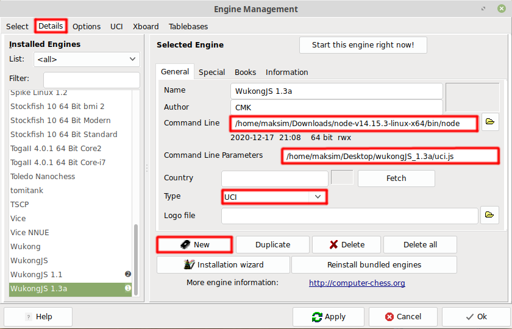

<h1 align="center">Install Wukong JS into Arena GUI</h1>

  

# UCI mode
1. Download latest <a href="https://nodejs.org/en/">nodejs</a>
2. Download <a href="https://github.com/maksimKorzh/wukongJS/raw/main/releases">source code</a>
3. UCI mode in console: "full/path/to/nodejs full/path/to/uci.js"
4. UCI mode in Arena GUI: set engine path to "full/path/to/nodejs" & command line parameters to "full/path/to/uci.js"
